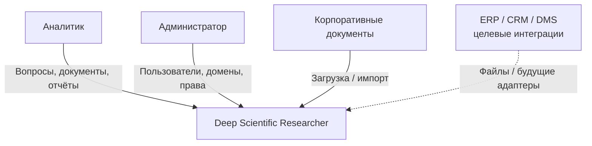
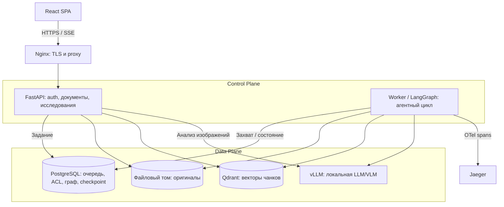
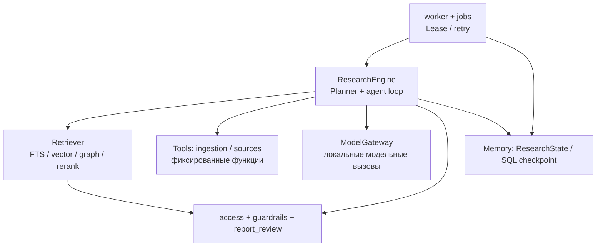
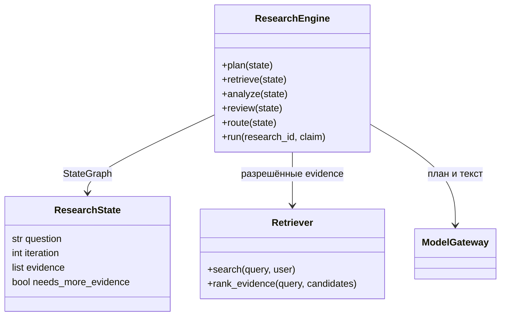
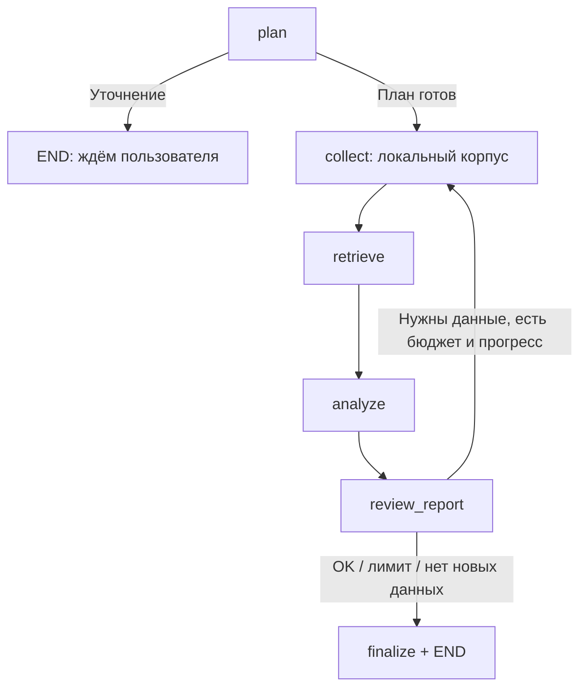
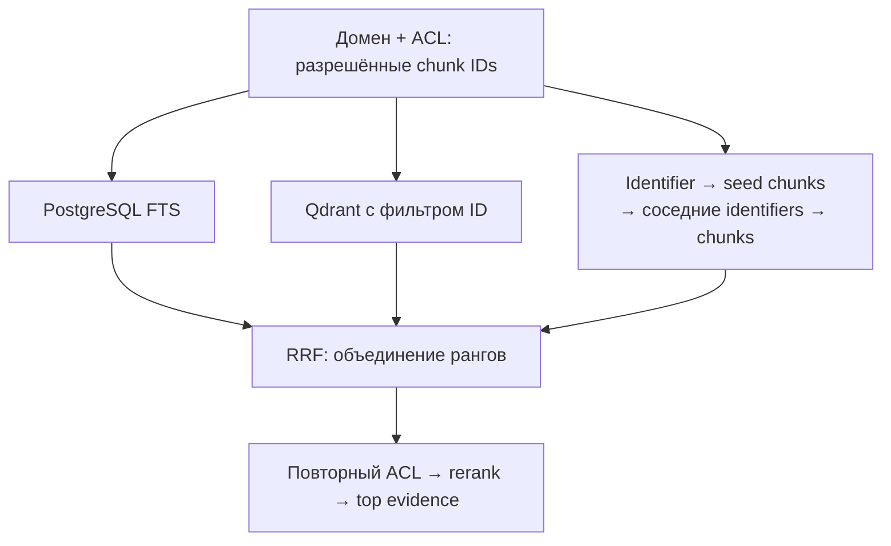
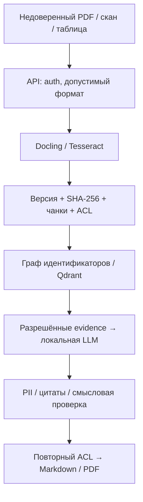
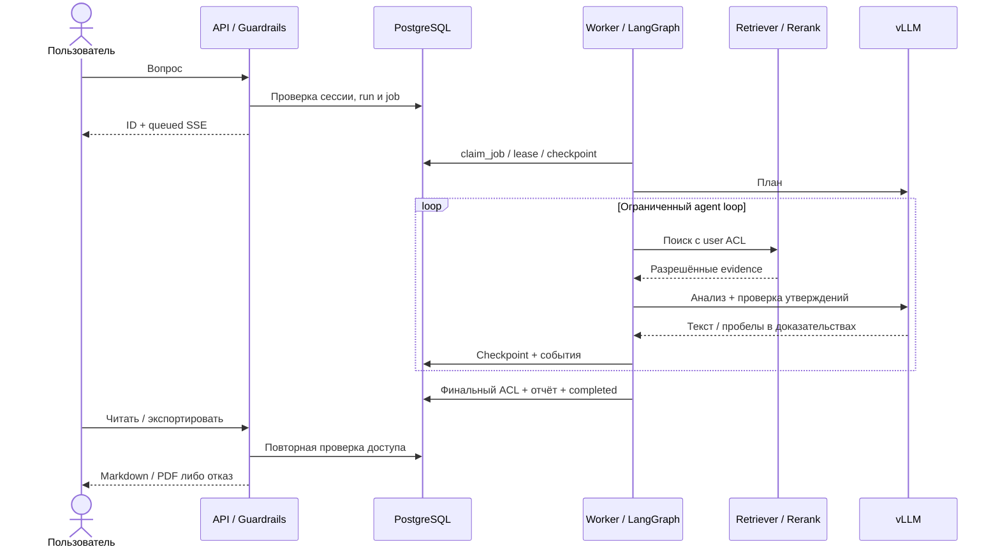
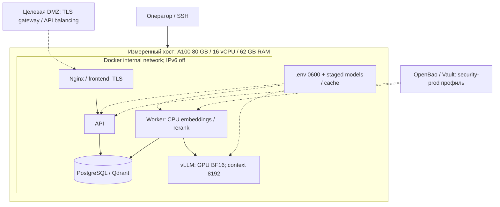

# Архитектура MVP

Система преобразует технические PDF, сканы и таблицы в отчёт на русском с проверяемыми цитатами. Профиль сдачи — локальные модели, `APP_MODE=airgap`, `GRAPH_RETRIEVAL_ENABLED=true`. Измерения и границы проверенного поведения — в [нагрузочном отчёте](load-report.md); выбор технологий — в [ADR](decisions.md).

## C1. Контекст

**C1. Граница системы.** В MVP документы загружаются через API/интерфейс; прямые ERP/CRM-коннекторы не реализованы. Интернет-сбор исходного connected-профиля не используется при сдаче.

## C2. Контейнеры и разделение плоскостей

**C2. Процессы и хранилища.** API и worker общаются через SQL-очередь. Embeddings и rerank работают локально внутри приложения. В измеренном стенде использован Jaeger. Prometheus, Grafana и Langfuse доступны дополнительными профилями [infra/](../infra/).

## C3. Компоненты агента

**C3. Ответственность компонентов.** Модель предлагает план и текст; код выполняет поиск, проверяет права и сохраняет результат. Memory — состояние run и PostgreSQL checkpoint, а не отдельный memory-сервис. В airgap внешний сбор пропускается. [Реализация](../backend/research.py).

## C4. Код ядра агента

**C4. Существующие классы и методы.** Поля/методы показаны выборочно; полный контракт — в [research.py](../backend/research.py), [retrieval.py](../backend/retrieval.py) и [vision.py](../backend/vision.py).

## B1. Stateful workflow

**B1. Цикл LangGraph.** `max_research_steps` ограничивает поиск; checkpoint привязан к `run_id`. Worker использует lease и heartbeat; retry продолжает тот же run. Отчёт и completed фиксируются атомарно. SSE передаёт статусы/этапы, а не токены LLM.

## R1. GraphRAG и контроль контекста

**R1. Поиск не расширяет права.** Онтология: Document → Chunk → Identifier; связи хранятся в PostgreSQL. Закрытый чанк не может быть мостом графа. Qwen3 Reranker использует yes/no logits и порог 0.1; произвольная семантическая онтология не строится. [Граф](../backend/knowledge_graph.py), [reranker](../backend/reranking.py), [ER](sql-data-model.md).

## F1. Data Flow и граница доверия

**F1. Документ — данные, а не инструкция агенту.** Оригинал и происхождение цитат сохраняются. Проверка удаляет неподтверждённые утверждения; недостаток данных приводит к уточнению/отказу. PII-фильтр покрывает email/телефоны, не полноценную DLP. Геометрию чертежей нужно сверять вручную.

## S1. Обработка запроса

**S1. Авторизация остаётся в коде.** Отзыв доступа закрывает ранее выданные ссылки, источники и экспорты. SSE читается из PostgreSQL; выполнение инструментов не передаётся модели.

## D1. Физическое размещение

**D1. Измеренное размещение и целевые расширения.** Семь сервисов работают на одном хосте; `unless-stopped` обеспечивает повторный запуск после reboot. API/worker/model не имеют внешнего выхода; сам хост подключён. DMZ, балансировка нескольких API и OpenBao с TLS — целевой профиль, не заявленный результат benchmark. В нём приложение и GPU могут быть разнесены; правила firewall разрешают только внутренние зависимости. [Compose стенда](../infra/compose.benchmark.yaml), [секреты/профили](operations.md).
