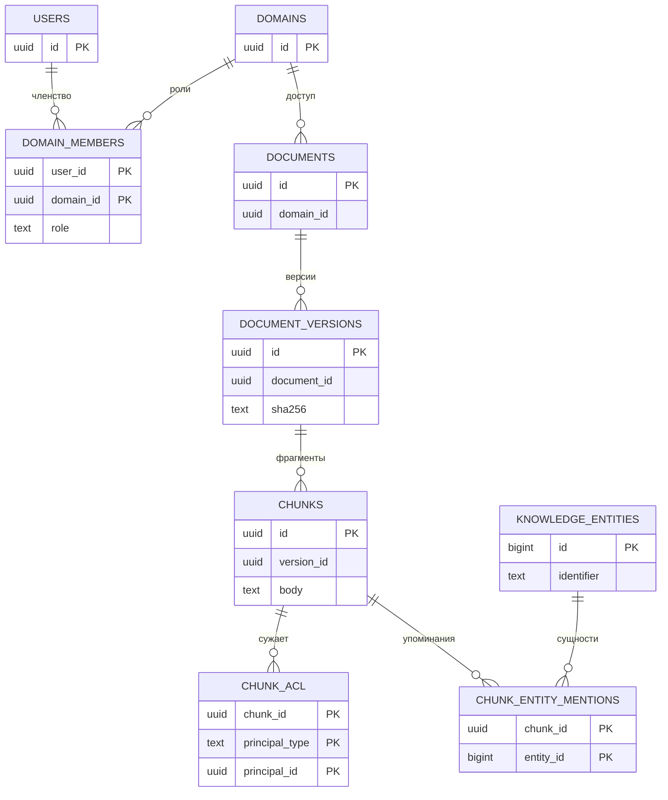
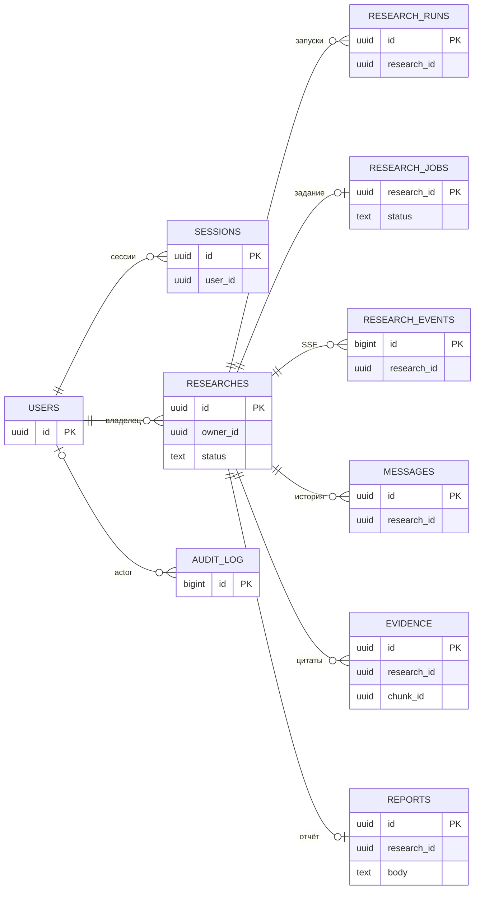

# Модель данных

Два ER-вида раскрывают Data Plane из [C2](architecture.md#c4-containers). Показаны ключевые поля и связи; полный DDL, FK, индексы и миграции — [backend/schema.sql](../backend/schema.sql). Связи на обзорной схеме логические; она не заменяет DDL.

## E1. Документы, права и GraphRAG

**E1. Происхождение и доступ.** Домен даёт базовое право, ACL чанка может только сузить его. `principal_id` полиморфный user/group; таблицы групп здесь опущены. Вектор Qdrant имеет UUID чанка, оригинал находится в файловом томе. Граф восстанавливается из разрешённых упоминаний; сущность сама по себе не открывает доступ к документу.

## E2. Сессии, очередь и результаты

**E2. Состояние и проверяемый ответ.** `evidence.chunk_id` ссылается на CHUNKS из E1; доступ проверяется заново при чтении отчёта. Сессии содержат hashes токенов, аудит — метаданные без текстов документов/секретов. Таблицы checkpoint создаёт PostgreSQL checkpointer LangGraph. PDF генерируется из Markdown и отдельно не хранится.
